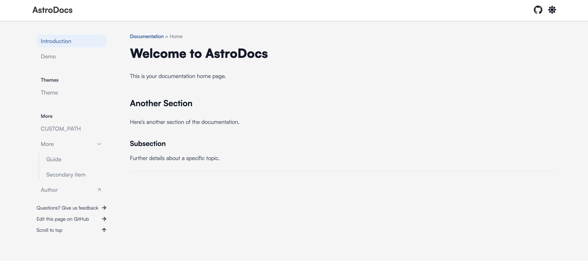

# Astro.js Documentation Template

This is a documentation template coded using Astro.js. It is a simple and easy-to-use documentation template that can be used for any project. It is fully responsive and works on all devices.

### Astro.js

Astro.js is a lightweight JavaScript library that allows you to create documentation websites easily. It is simple to use and has a lot of features that can be used to create a beautiful and functional documentation website. You can find more information about Astro.js [on their website](https://astro.build/).

## Techstack

This documentation template is built using the following technologies:
- [Astro.js](https://astro.build/)
- [Tailwind CSS](https://tailwindcss.com/)
- [MDX](https://mdxjs.com/)

## Features

This documentation template has the following features:
- Responsive design, works on all devices and screen sizes
- Easy to use and highly customizable to fit your needs
- Built with speed in mind, loads fast and is optimized for performance
- Dark mode support, switch between light and dark mode with a click of a button
- Syntax highlighting for code blocks, makes your code examples look great
- Table of contents, automatically generated from your markdown files
- Complete markdown support, write your documentation in markdown and Astro.js will take care of the rest

### Images
_this is a preliminary screenshot of the template, the design will be changed before initial release_

## Getting Started

This documentation template is not yet available for general use. It is currently in development and will be released soon. If you would like to be notified when it is released, please create a GitHub issue and we will get back to you as soon as possible.

## Contributing

I am completely open to contributions from the community! If you have any ideas, suggestions, or improvements that you would like to see in this template, please create a GitHub issue and I will get back to you as soon as possible.

If you would like to contribute to the development of this template, please fork this repository and create a pull request with your changes. I will review your changes and merge them if they are suitable.

> **Important information before contributing**:
> - You do not need to ask for permission to contribute, you can fork this repository and create a pull request with your changes
> - Please make sure that your changes are well-documented and follow the existing code style
> - You do not own the copyright to your contributions (within [this](https://github.com/Naainz/astro-docs) GitHub repository), however you will be credited / attributed for your work, unless you request otherwise.
> - You are not entitled to any financial compensation for your contributions. 
> - You are also not entitled to any part of this project's copyright.
> - You are still free to use the contributions in any other project, commercial or non-commercial.

## License

This project is licensed under the [GNU General Public License v3.0](https://www.gnu.org/licenses/gpl-3.0.en.html). You are free to use this template for any purpose, commercial or non-commercial. You are also free to modify the template to suit your needs. You are, however, obligated to provide a link back to this repository in your documentation page. This link must be publicly visible and must not be hidden or obscured in any way.

If you have any questions about the license, please create a GitHub issue and I will get back to you as soon as possible. 

I reserve the right to [change the license](https://opensource.guide/legal/#what-if-i-want-to-change-the-license-of-my-project) at any time without prior notice. If you are a user of this template, you are responsible for keeping up to date with the latest license terms.

## Contact

If you have any questions, suggestions, or feedback, please feel free to create a GitHub issue and I will get back to you as soon as possible.

I will not respond to any questions or requests that have been mentioned in this README, or in this project's documentation.